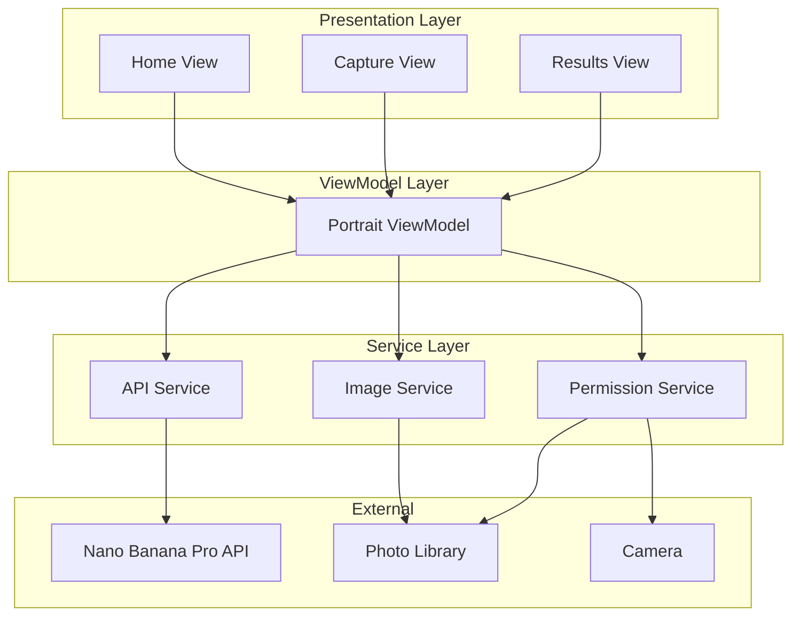
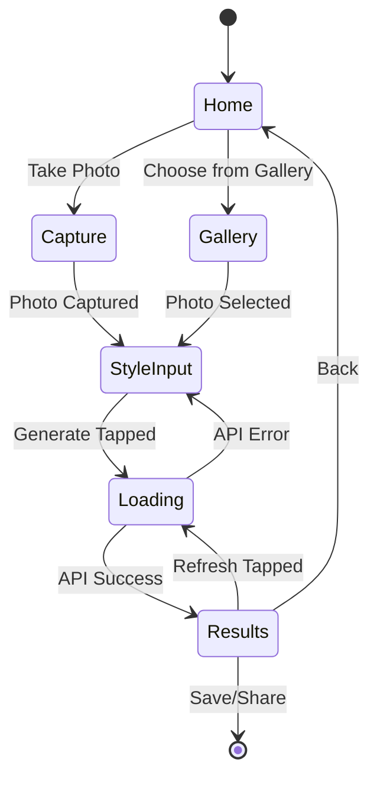
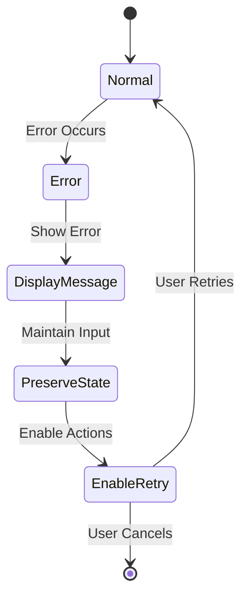

# Design Document: Pet Portrait App

## Overview

The Pet Portrait App is a native iOS application built with SwiftUI that transforms pet photos into AI-generated stylized portraits. The application follows a minimalist design philosophy, leveraging native Apple UI components to provide a clean, intuitive user experience.

The app's core workflow is straightforward: users either capture a new photo or select an existing one from their library, describe their desired artistic style through a text prompt, and receive an AI-generated portrait. Users can then generate variations, save portraits to their photo library, or share them through iOS's native sharing capabilities.

The architecture emphasizes simplicity and native integration, utilizing SwiftUI for the UI layer, UIKit interoperability for camera and photo picker access, and the Google Nano Banana Pro API for AI image generation.

## Architecture

### High-Level Architecture

The application follows the MVVM (Model-View-ViewModel) pattern, which is the recommended architecture for SwiftUI applications:



### Layer Responsibilities

**Presentation Layer (SwiftUI Views)**
- Renders UI using native SwiftUI components
- Handles user interactions and navigation
- Observes ViewModel state changes and updates UI reactively
- Maintains minimalist design aesthetic

**ViewModel Layer**
- Manages application state using `@Published` properties
- Coordinates between views and services
- Handles business logic for portrait generation workflow
- Provides loading states and error handling

**Service Layer**
- `APIService`: Manages communication with Nano Banana Pro API
- `ImageService`: Handles image saving and retrieval operations
- `PermissionService`: Manages camera and photo library permissions

### Navigation Flow



## Components and Interfaces

### View Components

#### HomeView
Primary entry point for the application.

**Responsibilities:**
- Display two action buttons: "Take Photo" and "Choose from Gallery"
- Navigate to appropriate photo source based on user selection
- Maintain minimalist design with ample white space

**State:**
- `showCamera: Bool` - Controls camera presentation
- `showPhotoPicker: Bool` - Controls photo picker presentation

**Interface:**
```swift
struct HomeView: View {
    @StateObject private var viewModel: PortraitViewModel
    @State private var showCamera = false
    @State private var showPhotoPicker = false
    
    var body: some View
}
```

#### CaptureView
Displays selected/captured photo and style input.

**Responsibilities:**
- Display the selected pet photo
- Provide text input field for style prompt
- Show "Generate" button
- Display loading animation during API processing
- Handle error states

**State:**
- Observes `PortraitViewModel` for image, prompt, loading state, and errors

**Interface:**
```swift
struct CaptureView: View {
    @ObservedObject var viewModel: PortraitViewModel
    
    var body: some View
}
```

#### ResultsView
Displays generated portrait with action buttons.

**Responsibilities:**
- Display AI-generated portrait
- Provide "Refresh", "Save", and "Share" action buttons
- Handle loading states during refresh operations
- Trigger save and share operations

**State:**
- Observes `PortraitViewModel` for generated portrait and loading state

**Interface:**
```swift
struct ResultsView: View {
    @ObservedObject var viewModel: PortraitViewModel
    
    var body: some View
}
```

### ViewModel

#### PortraitViewModel
Central state manager for the portrait generation workflow.

**Responsibilities:**
- Manage selected image and style prompt
- Coordinate API calls for portrait generation
- Handle loading states and errors
- Preserve state during error recovery
- Trigger image save and share operations

**Published Properties:**
```swift
class PortraitViewModel: ObservableObject {
    @Published var selectedImage: UIImage?
    @Published var stylePrompt: String = ""
    @Published var generatedPortrait: UIImage?
    @Published var isLoading: Bool = false
    @Published var errorMessage: String?
    
    private let apiService: APIService
    private let imageService: ImageService
    private let permissionService: PermissionService
}
```

**Methods:**
```swift
func generatePortrait() async
func refreshPortrait() async
func savePortrait()
func sharePortrait() -> [Any]
```

### Service Components

#### APIService
Handles all communication with the Nano Banana Pro API.

**Responsibilities:**
- Send image and style prompt to API
- Parse API responses
- Handle network errors and API errors
- Manage request/response serialization

**Interface:**
```swift
protocol APIServiceProtocol {
    func generatePortrait(image: UIImage, stylePrompt: String) async throws -> UIImage
}

class APIService: APIServiceProtocol {
    private let baseURL: URL
    private let apiKey: String
    private let session: URLSession
    
    func generatePortrait(image: UIImage, stylePrompt: String) async throws -> UIImage
}
```

**API Request Format:**
- Endpoint: POST to Nano Banana Pro image generation endpoint
- Body: Multipart form data containing image file and style prompt text
- Headers: Authorization with API key

**API Response Format:**
- Success: Image data in response body
- Error: JSON with error code and message

#### ImageService
Manages image persistence operations.

**Responsibilities:**
- Save images to photo library
- Handle photo library write permissions
- Provide error handling for save operations

**Interface:**
```swift
protocol ImageServiceProtocol {
    func saveToPhotoLibrary(_ image: UIImage) async throws
}

class ImageService: ImageServiceProtocol {
    func saveToPhotoLibrary(_ image: UIImage) async throws
}
```

#### PermissionService
Manages camera and photo library permissions.

**Responsibilities:**
- Check current permission status
- Request permissions when needed
- Provide permission status to ViewModels

**Interface:**
```swift
protocol PermissionServiceProtocol {
    func checkCameraPermission() -> PermissionStatus
    func requestCameraPermission() async -> Bool
    func checkPhotoLibraryPermission() -> PermissionStatus
    func requestPhotoLibraryPermission() async -> Bool
}

enum PermissionStatus {
    case notDetermined
    case authorized
    case denied
}

class PermissionService: PermissionServiceProtocol {
    func checkCameraPermission() -> PermissionStatus
    func requestCameraPermission() async -> Bool
    func checkPhotoLibraryPermission() -> PermissionStatus
    func requestPhotoLibraryPermission() async -> Bool
}
```

### UIKit Integration Components

#### CameraViewController
UIKit wrapper for camera access.

**Responsibilities:**
- Present UIImagePickerController for camera
- Handle photo capture callbacks
- Bridge captured image to SwiftUI

**Interface:**
```swift
struct CameraViewController: UIViewControllerRepresentable {
    @Binding var image: UIImage?
    @Environment(\.presentationMode) var presentationMode
    
    func makeUIViewController(context: Context) -> UIImagePickerController
    func updateUIViewController(_ uiViewController: UIImagePickerController, context: Context)
    func makeCoordinator() -> Coordinator
}
```

#### PhotoPickerViewController
UIKit wrapper for photo library access.

**Responsibilities:**
- Present UIImagePickerController for photo library
- Handle photo selection callbacks
- Bridge selected image to SwiftUI

**Interface:**
```swift
struct PhotoPickerViewController: UIViewControllerRepresentable {
    @Binding var image: UIImage?
    @Environment(\.presentationMode) var presentationMode
    
    func makeUIViewController(context: Context) -> UIImagePickerController
    func updateUIViewController(_ uiViewController: UIImagePickerController, context: Context)
    func makeCoordinator() -> Coordinator
}
```

## Data Models

### Portrait
Represents a generated portrait with its metadata.

```swift
struct Portrait: Identifiable, Codable {
    let id: UUID
    let originalImageData: Data
    let generatedImageData: Data
    let stylePrompt: String
    let createdAt: Date
}
```

**Properties:**
- `id`: Unique identifier for the portrait
- `originalImageData`: The original pet photo as Data
- `generatedImageData`: The AI-generated portrait as Data
- `stylePrompt`: The style description used for generation
- `createdAt`: Timestamp of portrait creation

### APIRequest
Encapsulates data sent to the Nano Banana Pro API.

```swift
struct APIRequest {
    let image: UIImage
    let stylePrompt: String
    let apiKey: String
}
```

### APIResponse
Represents the response from the Nano Banana Pro API.

```swift
struct APIResponse {
    let imageData: Data
}
```

### APIError
Represents errors from the API or network layer.

```swift
enum APIError: LocalizedError {
    case networkError(Error)
    case invalidResponse
    case apiError(code: Int, message: String)
    case imageConversionError
    
    var errorDescription: String? {
        switch self {
        case .networkError:
            return "Unable to connect to the service. Please check your internet connection."
        case .invalidResponse:
            return "Received an invalid response from the service."
        case .apiError(_, let message):
            return message
        case .imageConversionError:
            return "Unable to process the image."
        }
    }
}
```

### PermissionError
Represents permission-related errors.

```swift
enum PermissionError: LocalizedError {
    case cameraAccessDenied
    case photoLibraryAccessDenied
    
    var errorDescription: String? {
        switch self {
        case .cameraAccessDenied:
            return "Camera access is required to take photos. Please enable it in Settings."
        case .photoLibraryAccessDenied:
            return "Photo library access is required. Please enable it in Settings."
        }
    }
}
```


## Correctness Properties

*A property is a characteristic or behavior that should hold true across all valid executions of a system—essentially, a formal statement about what the system should do. Properties serve as the bridge between human-readable specifications and machine-verifiable correctness guarantees.*

### Property 1: API Request Completeness

*For any* selected image and style prompt, when the user triggers portrait generation, the API request SHALL include both the image data and the style prompt text.

**Validates: Requirements 2.2, 6.1**

### Property 2: API Response Display

*For any* successful API response containing a generated portrait image, the application SHALL update the displayed portrait to show the received image.

**Validates: Requirements 2.3, 6.2**

### Property 3: Image Selection Display

*For any* image selected through either camera capture or photo library selection, the application SHALL display that image in the capture view.

**Validates: Requirements 4.2, 5.2**

### Property 4: Style Input Availability

*For any* image selection event (camera capture or photo library selection), the application SHALL display the style input text field labeled "How should we style your pet?".

**Validates: Requirements 4.3, 5.3**

### Property 5: Camera Interface Activation

*For any* application state, when the user taps the "Take Photo" button, the application SHALL present the camera interface.

**Validates: Requirements 4.1**

### Property 6: Photo Picker Activation

*For any* application state, when the user taps the "Choose from Gallery" button, the application SHALL present the photo picker interface.

**Validates: Requirements 5.1**

### Property 7: Loading State Behavior

*For any* active API request, while waiting for a response, the application SHALL disable the "Generate" button AND display a loading animation.

**Validates: Requirements 7.1, 7.2**

### Property 8: Refresh Input Preservation

*For any* results screen state with an original image and style prompt, when the user taps "Refresh", the application SHALL send the identical image and style prompt to the API (not new or modified values).

**Validates: Requirements 8.1**

### Property 9: Refresh Portrait Update

*For any* refresh operation that receives a new portrait from the API, the application SHALL replace the currently displayed portrait with the new portrait image.

**Validates: Requirements 8.2**

### Property 10: Portrait Persistence

*For any* generated portrait displayed on the results screen, when the user taps "Save", the application SHALL save that portrait image to the device's photo library.

**Validates: Requirements 9.2**

### Property 11: Share Sheet Presentation

*For any* generated portrait displayed on the results screen, when the user taps "Share", the application SHALL present the native share sheet populated with the generated portrait image.

**Validates: Requirements 10.1, 10.2**

### Property 12: Error Message Display

*For any* error condition (API error or network failure), the application SHALL display a localized error message to the user.

**Validates: Requirements 13.1, 13.3**

### Property 13: Error State Preservation (Invariant)

*For any* error condition (API error or network failure), the application SHALL preserve the user's selected image and style prompt without modification.

**Validates: Requirements 13.2, 13.4**

### Property 14: Error Recovery Capability

*For any* error state, the application SHALL enable the "Generate" button to allow the user to retry the portrait generation request.

**Validates: Requirements 13.5**

## Error Handling

### Error Categories

The application handles four primary categories of errors:

**1. Network Errors**
- Connection timeouts
- No internet connectivity
- DNS resolution failures
- Server unreachable

**Strategy:**
- Display user-friendly message: "Unable to connect to the service. Please check your internet connection."
- Preserve all user input (image and style prompt)
- Re-enable "Generate" button for retry
- Log error details for debugging

**2. API Errors**
- Invalid API key
- Rate limiting
- Invalid request format
- Service unavailable (5xx errors)

**Strategy:**
- Parse error response from API for specific error message
- Display localized error message from API or fallback message
- Preserve all user input
- Re-enable "Generate" button for retry
- Log error code and message

**3. Permission Errors**
- Camera access denied
- Photo library access denied

**Strategy:**
- Display permission-specific message with guidance to Settings
- For camera: "Camera access is required to take photos. Please enable it in Settings."
- For photo library: "Photo library access is required. Please enable it in Settings."
- Provide button to open Settings app
- Gracefully handle permission denial without crashing

**4. Image Processing Errors**
- Image conversion failures
- Corrupted image data
- Unsupported image formats

**Strategy:**
- Display message: "Unable to process the image. Please try a different photo."
- Clear the problematic image
- Return user to photo selection
- Log error details

### Error Handling Flow



### Error Recovery Mechanisms

**State Preservation:**
- ViewModel maintains `selectedImage` and `stylePrompt` in error states
- Error state does not clear or modify user input
- Navigation stack preserved to allow easy retry

**User Feedback:**
- All errors display through a consistent alert dialog
- Error messages are localized and user-friendly
- Technical details logged but not shown to users

**Retry Logic:**
- No automatic retry (user must explicitly retry)
- "Generate" button re-enabled after error
- Same inputs used for retry unless user modifies them
- No retry limit (user can retry indefinitely)

**Graceful Degradation:**
- Permission errors don't crash the app
- Network errors don't block other app functionality
- API errors don't corrupt app state

## Testing Strategy

### Overview

The testing strategy employs a dual approach combining unit tests for specific scenarios and property-based tests for comprehensive coverage of the correctness properties defined in this document.

### Unit Testing

Unit tests focus on specific examples, edge cases, and integration points:

**ViewModel Tests:**
- Initial state verification (empty image, empty prompt, not loading)
- State transitions after user actions
- Error state handling with specific error types
- Permission handling edge cases

**Service Tests:**
- APIService with mocked network responses
- ImageService with mocked photo library
- PermissionService with mocked permission states
- Specific error scenarios (timeout, 404, 500, etc.)

**View Tests:**
- UI element presence and labels
- Button action bindings
- Navigation flow verification
- Loading state UI updates

**Edge Cases:**
- Empty style prompt handling
- Very large images
- Special characters in style prompts
- Rapid button tapping (debouncing)
- App backgrounding during API call

**Framework:** XCTest (native iOS testing framework)

### Property-Based Testing

Property-based tests verify the universal properties across randomized inputs. Each property test will run a minimum of 100 iterations with varied inputs.

**Framework:** SwiftCheck (Swift property-based testing library)

**Test Configuration:**
```swift
// Each property test configured with minimum iterations
let config = CheckerArguments(
    replay: nil,
    maxAllowableSuccessfulTests: 100,
    maxAllowableDiscardedTests: 500,
    maxTestCaseSize: 100
)
```

**Property Test Suite:**

Each correctness property from the design document will be implemented as a property-based test with the following tag format in comments:

```swift
// Feature: pet-portrait-app, Property 1: API Request Completeness
func testAPIRequestCompleteness() {
    property("API requests include both image and style prompt") <- forAll { 
        (image: UIImage, prompt: String) in
        // Test implementation
    }
}
```

**Generators:**

Custom generators will be created for:
- `UIImage`: Random images of various sizes and formats
- `String`: Style prompts with various lengths and character sets
- `APIResponse`: Valid and invalid API responses
- `PermissionStatus`: All permission states
- `APIError`: Various error types and codes

**Property Test Coverage:**

1. **Property 1 (API Request Completeness):** Generate random images and prompts, verify both are included in API requests
2. **Property 2 (API Response Display):** Generate random API responses, verify portrait updates
3. **Property 3 (Image Selection Display):** Generate random images, verify display after selection
4. **Property 4 (Style Input Availability):** Verify input field appears for any image selection
5. **Property 5 (Camera Interface Activation):** Verify camera presents for any initial state
6. **Property 6 (Photo Picker Activation):** Verify picker presents for any initial state
7. **Property 7 (Loading State Behavior):** Verify button disabled and animation shown during any API call
8. **Property 8 (Refresh Input Preservation):** Generate random inputs, verify refresh uses same values
9. **Property 9 (Refresh Portrait Update):** Generate random portraits, verify display updates
10. **Property 10 (Portrait Persistence):** Generate random portraits, verify save operation
11. **Property 11 (Share Sheet Presentation):** Generate random portraits, verify share sheet contains image
12. **Property 12 (Error Message Display):** Generate random errors, verify message display
13. **Property 13 (Error State Preservation):** Generate random errors and inputs, verify inputs unchanged
14. **Property 14 (Error Recovery Capability):** Generate random errors, verify retry enabled

### Integration Testing

Integration tests verify end-to-end workflows:

**Happy Path:**
1. Launch app → Select photo → Enter prompt → Generate → View results → Save
2. Launch app → Take photo → Enter prompt → Generate → View results → Share

**Error Recovery Path:**
1. Select photo → Enter prompt → Generate (network error) → Retry → Success

**Permission Path:**
1. Launch app → Take photo (no permission) → Grant permission → Take photo → Success

### UI Testing

UI tests verify the complete user experience using XCUITest:

- Navigation flow through all screens
- Button interactions and state changes
- Alert presentation and dismissal
- Share sheet presentation
- Camera and photo picker integration

### Test Execution

**Local Development:**
- Unit tests run on every build
- Property tests run before commits
- UI tests run before pull requests

**CI/CD Pipeline:**
- All tests run on pull request
- Tests run on multiple iOS versions (iOS 15, 16, 17)
- Tests run on multiple device simulators (iPhone SE, iPhone 14, iPhone 14 Pro Max)

### Coverage Goals

- Unit test coverage: >80% of ViewModel and Service code
- Property test coverage: 100% of correctness properties
- UI test coverage: All critical user paths
- Edge case coverage: All identified edge cases from requirements

